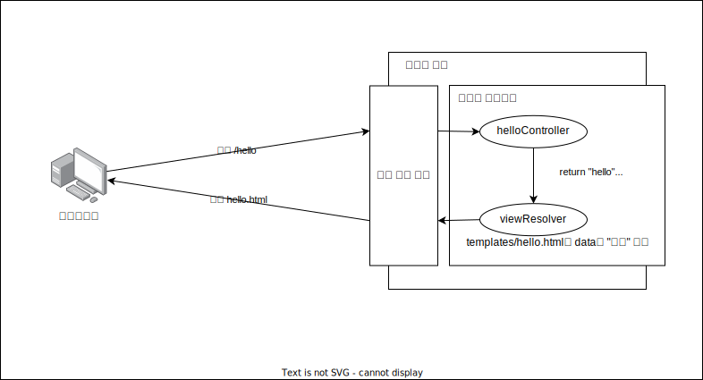

## 스프링 프로젝트 생성

[start.spring.io](https://start.spring.io)에 접속하면 스프링 프로젝트를 생성할 수 있다.
start.spring.io에서 스프링 프로젝트의 의존성, 메타 데이터, 스프링 부트 버전, 언어를 설정할 수 있다. 프로젝트를 압축 해제하고 IDE에서 열면 된다.

- 버전은 뒤에 아무것도 안 붙은게 정식 버전이다.
- 의존성 항목에서 검색을 통해 패키지 설치가 가능하다.

## 스프링 mvc welcome page 기능

스프링에서 index.html 파일을 /static 에 넣으면 스프링이 root url로 index.html을 보여준다.

## thymeleaf 템플릿 엔진 사용

```java
@Controller
public class HelloController {

    // http get메소드 hello에 대한 요청은 아래의 메서드가 담당한다.
    @GetMapping("hello")
    // Model은 템플릿 엔진에 바인딩 될 데이터를 Map 형식으로 받는다.
    public String hello(Model model) {
        // "안녕" 이라는 값은 템플릿 엔진의 ${data}에 바인딩된다.
        model.addAttribute("data", "안녕");
        // 반환값인 "hello"는 templates/hello.html을 가리킨다.
        return "hello";
    }

}
```

templates/hello.html
```html
<!DOCTYPE HTML>
<html xmlns:th="http://www.thymeleaf.org">
<head>
    <title>Hello</title>
    <meta http-equiv="Content-Type" content="text/html; charset=UTF-8" />
</head>
<body>
<p th:text="'안녕하세요. ' + ${data}" >안녕하세요. 손님</p> <!-- ${data} 부분에  -->
</body>
</html>
```

컨트롤러가 문자열을 반환하면 viewResolver가 /templates/ + {반환한 문자열} + .html을 처리한다.



## 빌드, 실행

```sh
./gradlew build`
`java -jar build/libshello-spring-0.0.1-SNAPSHOT.jar`
```
